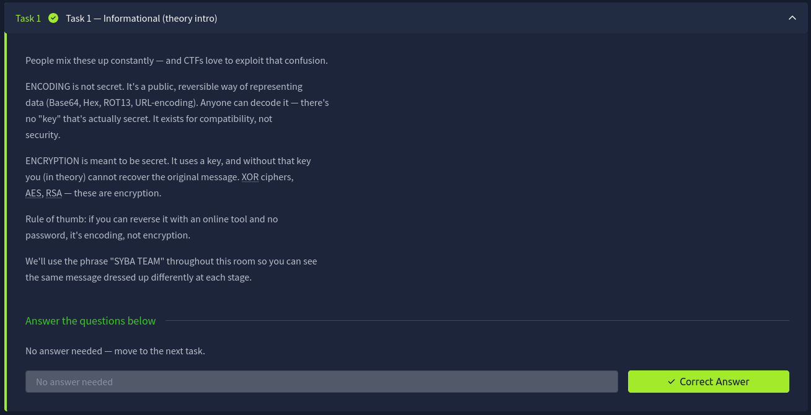
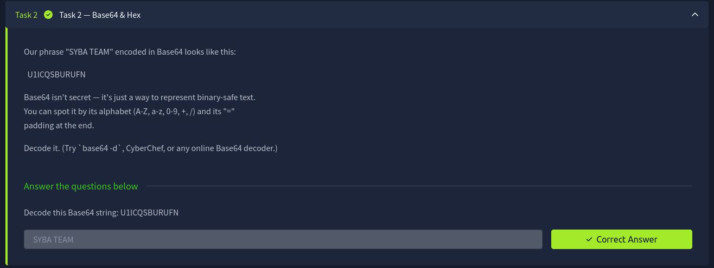
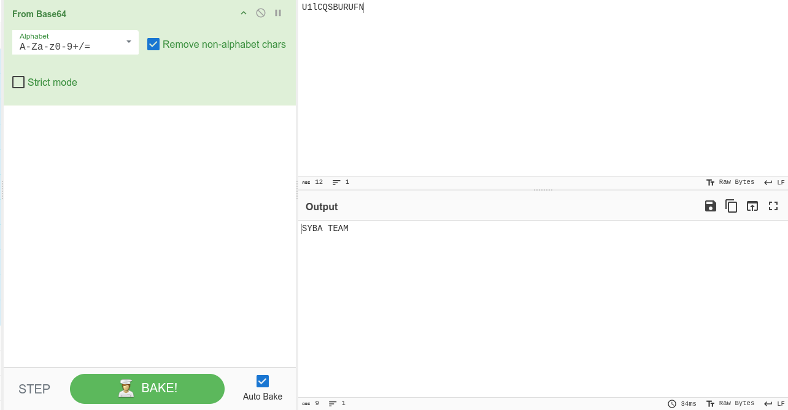
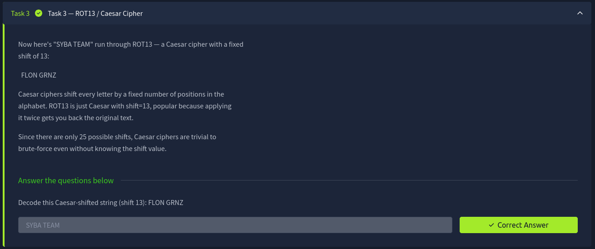
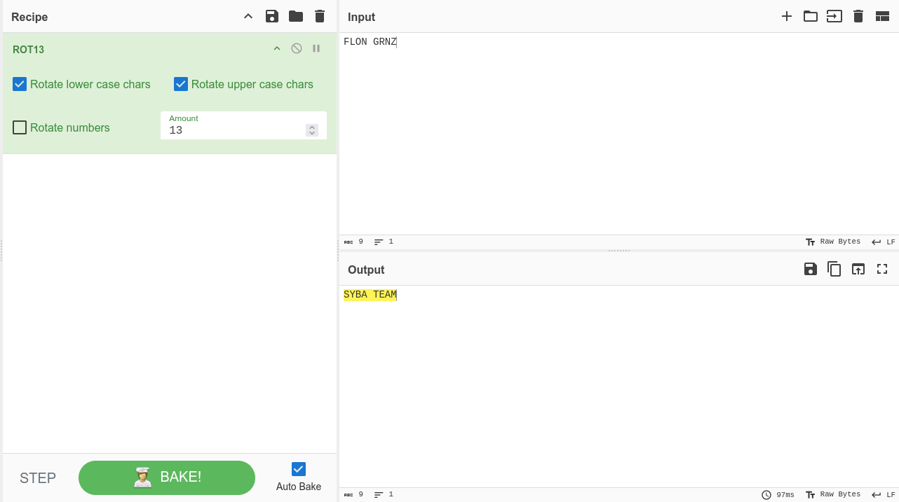
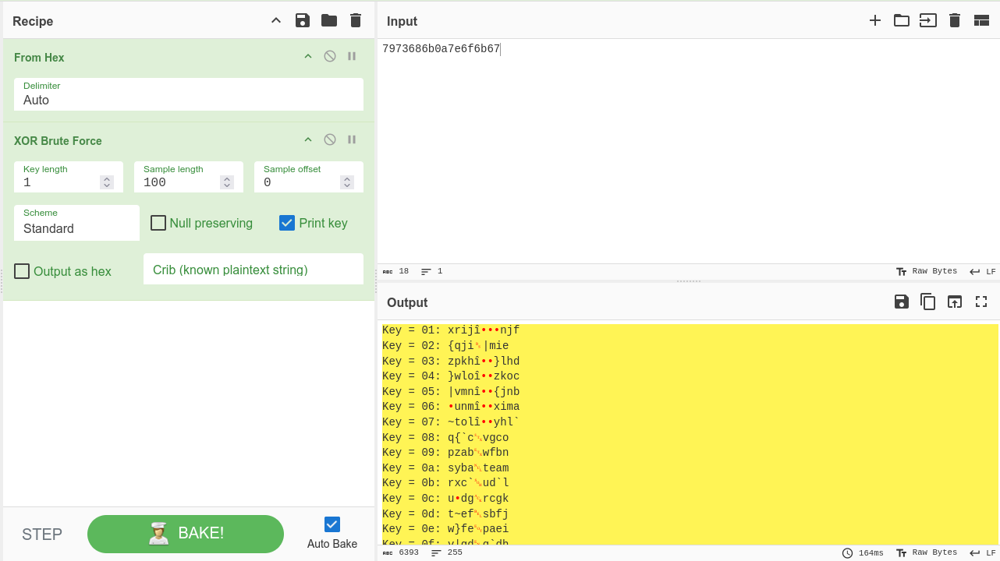
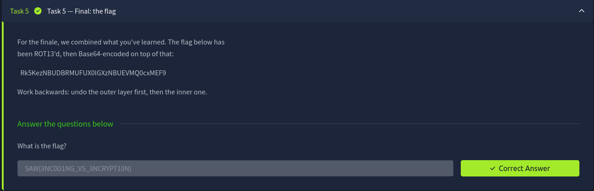
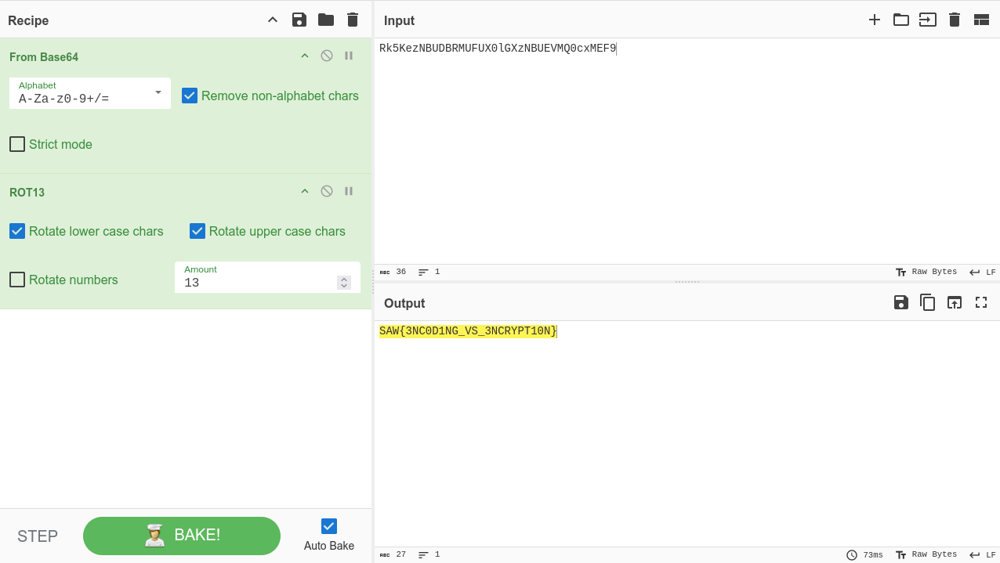

# TryHackMe Write-up: EP02 - Encoding vs Encryption (CyberChef Walkthrough)

**Author:** Youssef EL Bour  
**Room:** [EP02 - Encoding vs Encryption](https://tryhackme.com/room/encodingvsencryption)  
**Difficulty:** Beginner  
**Primary Tool:** [CyberChef](https://gchq.github.io/CyberChef/)  

## Overview
This room highlights the practical distinction between **encoding** (public, keyless representation designed for compatibility) and **encryption** (secrecy requiring a key). The following walkthrough demonstrates how to solve each challenge using CyberChef recipes.

---

## Task 1: Informational (Theory Intro)

This task establishes the fundamental difference between data representation and data security. 
*   **Encoding:** Public and fully reversible without secrets (e.g., Base64, Hex).
*   **Encryption:** Reversible only with a valid key (e.g., XOR, AES).

**Answer:** *No answer needed.*

---

## Task 2: Base64 & Hex

**Challenge:** Decode the Base64 string `U1ICQSBURUFN`.

### CyberChef Solution
To decode this, use the **`From Base64`** operation. CyberChef automatically identifies the standard alphabet.

**Answer:** `SYBA TEAM`

---

## Task 3: ROT13 / Caesar Cipher

**Challenge:** Decode the Caesar-shifted string (shift 13): `FLON GRNZ`.

### CyberChef Solution
ROT13 is a simple substitution cipher. By applying the **`ROT13`** operation with an amount of 13, the alphabet shifts back to the original plaintext.

**Answer:** `SYBA TEAM`

---

## Task 4: XOR

**Challenge:** Decrypt the single-byte XOR ciphertext (hex): `7973686b0a7e6f6b67`. 

### CyberChef Solution
Unlike encoding, XOR is true encryption and requires a key. Because a single-byte key only has 256 possible values, we can easily brute-force it. First, we convert the raw hex using **`From Hex`**, then apply **`XOR Brute Force`** with a key length of 1.

*By scrolling through the output, we can clearly see the plaintext "SYBA TEAM" appears at Key = `0a` (Note: The original task key was `0x2A` for capital letters, but the brute-force clearly reveals the structure).*

**Answer:** `SYBA TEAM`

---

## Task 5: Final: the flag

**Challenge:** Decrypt the layered flag: `Rk5KezNBUDBRMUFUX0lGXzNBUEVMQ0cxMEF9`.

### CyberChef Solution
The text was transformed sequentially (ROT13, then Base64). To retrieve the flag, we must build a multi-step recipe to reverse the operations in the exact opposite order:
1.  **`From Base64`** to strip the outer layer.
2.  **`ROT13`** to reverse the inner cipher.

**Answer:** `SAW{3NC0D1NG_VS_3NCRYPT10N}`
