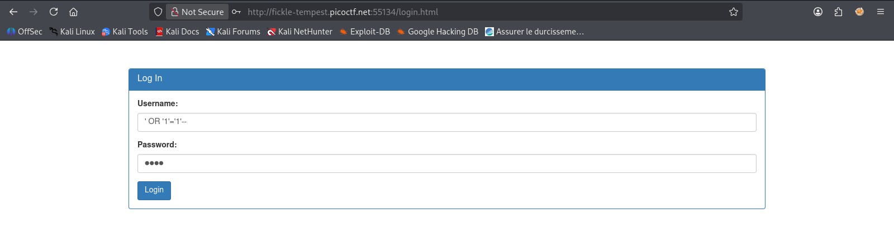
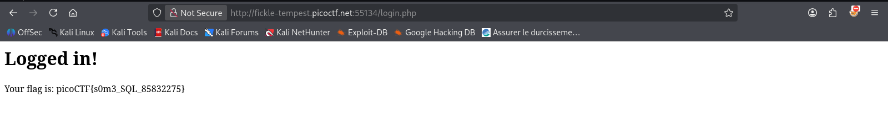
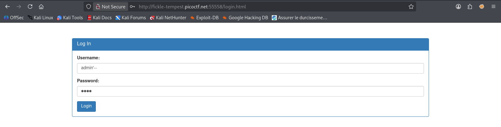

# picoCTF: Irish Name Repo Series - SQL Injection Writeup

This folder contains the writeup for the **Irish Name Repo Series** (Challenges 1-3). This series focuses on progressively difficult SQL Injection (SQLi) vulnerabilities to bypass authentication.

## Challenge 1: Irish-Name-Repo 1

### Overview
Navigating to the challenge URL presents us with a "List 'o the Irish!" directory and a hidden Admin Login portal on the side menu.

### Exploitation
1. **Identify the entry point:** The Admin Login form accepts a username and password with no apparent input sanitization.
2. **Inject:** We can force an always-true condition using a basic SQL tautology. Enter the following payload into the username field:
   `' OR '1'='1'--`

3. **Execution:** The backend query translates to:
   `SELECT * FROM users WHERE username = '' OR '1'='1'--' AND password = ''`
   The `--` comments out the password check, granting us access.

### Result
Authentication is bypassed, and the flag is revealed:
`picoCTF{s0m3_SQL_85832275}`

---

## Challenge 2: Irish-Name-Repo 2

### Overview
The same login portal is used, but a filter is now active. Entering common SQLi keywords like `OR` results in an `SQLi detected` error.

### Exploitation
1. **Bypass the filter:** Since `OR` is blocked, we cannot rely on a tautology. Instead, we target a known user. Assuming the default administrator account is `admin`, we can log in directly by commenting out the password validation.
2. **Inject:** Enter the following into the username field:
   `admin'--`

3. **Execution:** The backend query translates to:
   `SELECT * FROM users WHERE username = 'admin'--' AND password = ''`
   This cleanly selects the admin user and drops the password requirement, bypassing the keyword filter completely to retrieve the next flag.

---

## Challenge 3: Irish-Name-Repo 3

### Overview
The login page now only has a single password field. The backend server applies a ROT13 cipher transformation to the user input before inserting it into the SQL query.

### Exploitation
1. **Identify the transformation:** Submitting standard SQLi syntax like `' OR '1'='1` returns a syntax error exposing transformed text (e.g., `near "$cnffjbeq": syntax error`).
2. **Encode the payload:** To inject `' OR '1'='1`, we must pre-encode our payload with ROT13 so the server decodes it back into valid SQL syntax. 
   * `'` remains `'`
   * `O` becomes `B`
   * `R` becomes `E`
3. **Inject:** Enter the ROT13 encoded payload:
   `' BE '1'='1`
4. **Execution:** The server applies ROT13 to our input, converting `BE` back to `OR`. The executed query evaluates to true, bypassing the final login check.
